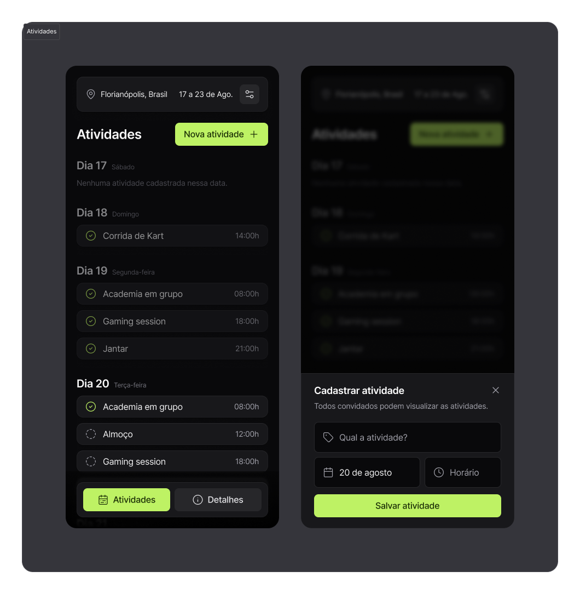

<h1 align="center">
# plann.er
    <br>
    <br>
     <p align="center" >
     
    
     
     
  </p>

</h1>

O plann.er é um aplicativo para planejar viagens, convidar amigos e gerenciar os detalhes de uma viagem. Com ele, você pode definir o destino, selecionar datas e convidar amigos por e-mail. Foi desenvolvido na NLW-journey da Rocket Seat

## Funcionalidades

- **Planejamento de Viagens**: Adicione o destino e selecione as datas de ida e volta.
- **Convite de Amigos**: Convide seus amigos para a viagem via e-mail.
- **Persistência de Dados**: Armazene os detalhes da viagem localmente e no servidor.

## Algumas Tecnologias Utilizadas

- React Native
- TypeScript
- Expo
- `react-native-calendars`
- `dayjs`
- Componentes personalizados

## Instalação

1. Clone o repositório:

    ```sh
    git clone https://github.com/Whuanderson/NLW-Journey.git
    ```

2. Navegue até o diretório do projeto:

    ```sh
    cd NLW-Journey
    ```

3. Instale as dependências:

    ```sh
    npm install
    ```

4. Inicie o aplicativo:

    ```sh
    npx expo start
    ```

## Uso

### Planejamento de Viagens

1. **Adicionar Detalhes da Viagem**:
    - Insira o destino.
    - Selecione as datas de ida e volta.

2. **Convidar Amigos**:
    - Após adicionar os detalhes da viagem, avance para a etapa de convite.
    - Insira os e-mails dos amigos que deseja convidar e clique em "Convidar".

3. **Finalizar a Viagem**:
    - Após adicionar os convidados, confirme a viagem.

### Persistência de Dados

- As informações da viagem são salvas localmente e no servidor.
- Caso já exista uma viagem planejada, o aplicativo carregará automaticamente os detalhes ao iniciar.

## Estrutura do Projeto

- **components**: Componentes reutilizáveis como `Modal`, `Input`, `Button`, etc.
- **screens**: Telas principais do aplicativo.
- **storage**: Funções para armazenamento local.
- **server**: Comunicação com o servidor.
- **utils**: Funções utilitárias, como validação de entradas e manipulação de calendário.
- **assets**: Recursos estáticos como imagens e ícones.


## Licença

Este projeto está licenciado sob a Licença MIT - veja o arquivo [LICENSE](LICENSE) para mais detalhes.

## Contato

- **GitHub**: [whuanderson](https://github.com/whuanderson)
- **Repositório**: [NLW-Journey](https://github.com/Whuanderson/NLW-Journey.git)

## Obs

Este projeto precisa de um back-end desenvolvido em outra trilha no mesmo NLW da rocketseat.

